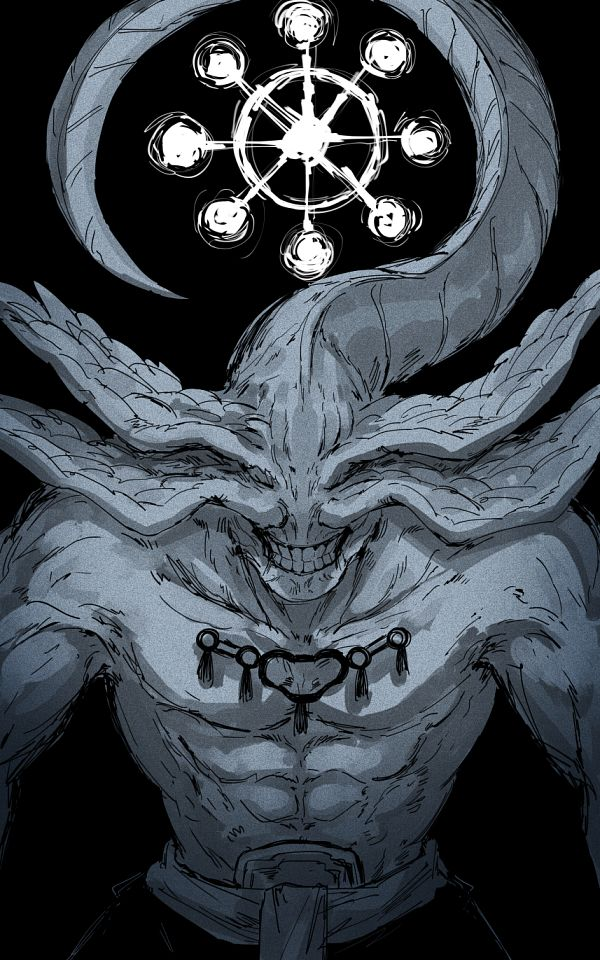
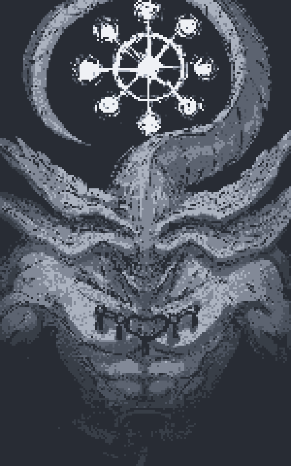
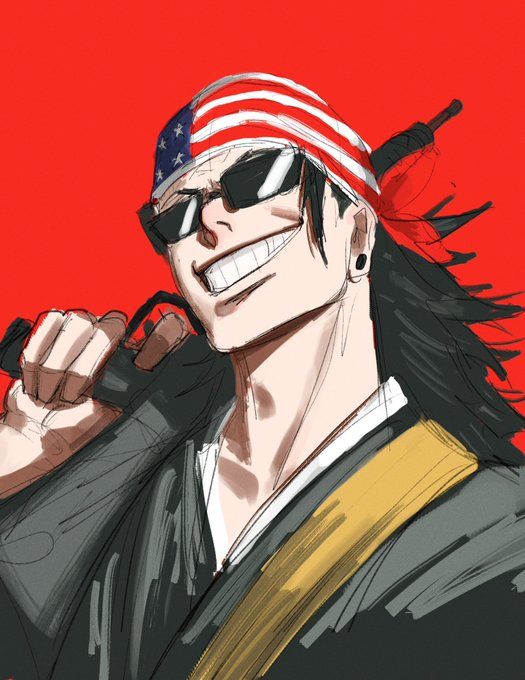
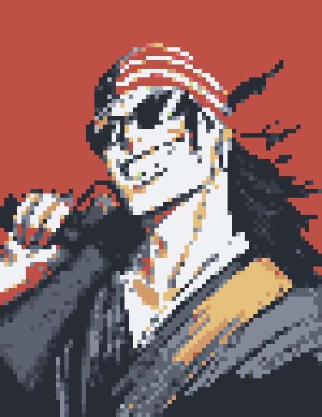

# pxlate
- apply filters to images

## features:
- smudges the image
- generates pixel art for your image with varying levels of detail

## So far:
<div style="display: flex; justify-content: space-between;">
    
    
    
</div>

## Requirements
- [Rust](https://www.rust-lang.org/tools/install) (version 1.65 or later)

## Getting Started

Follow the steps below to clone the repository and build the project.

### 1. Clone the Repository
To get started, clone the repository to your local machine:
```bash
git clone https://github.com/sofaspawn/pxlate.git
cd pxlate
```

### 2. Build the Project
Next, build the project using the following command:
```bash
cargo build --release
```

### 3. Run the Project
Finally, run the project using the following command:
```bash
cargo run --release
```

### 4. Binary Installation(Optional)
To install the binary on your system, run the following command:
```bash
cargo install --path .
```
This allows you to the application as a command:
```bash
pxlate pixelate <image_path> <output_image> 20
```

### Result:
<div style="display: flex; justify-content: space-between;">
    
    
</div>


## TODO:
- [x] take image as input in the form of command arguements
- [x] read the image pixels
- [x] make a square window of 2x2 pixels
- [x] replace the window with the average value of the 2x2 pixel grid
- [x] move the window for the entire image
- [x] render the image
- [x]  add more functions such as "actual" pixelate, negative, etc...
- [x] downscale image -> apply color from color pallete -> upscale image

- [ ] improve the ui
- [x] add commands for changing the scaling factor
- [x] add commands to check if the user wants to pixelate or smudge
- [x] automatically change the scaling factor based on the file size of images
- [ ] restructure the color palette code

- [ ] gracefully handle errors

## Problems:
- [x] black is almost always red (check the color_diff)
- [x] the scaling factor changes for every image i.e. make it more user friendly i.e.i.e. add a command for that
