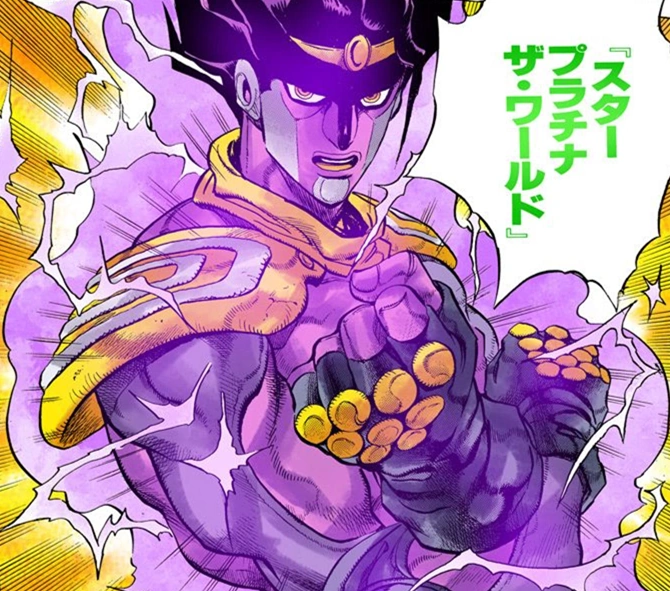
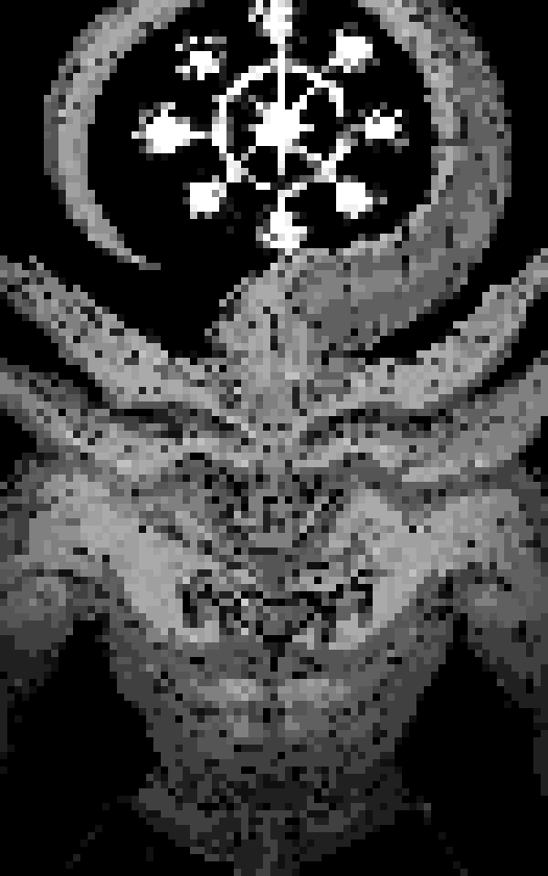

# pxlate
- apply filters to images

## features:
- smudges the image
- does a pretty rudimentary rendering of pixelated image

## So far:

    
    

## TODO:
- [x] take image as input in the form of command arguements
- [x] read the image pixels
- [x] make a square window of 2x2 pixels
- [x] replace the window with the average value of the 2x2 pixel grid
- [x] move the window for the entire image
- [x] render the image

- [ ]  add more functions such as "actual" pixelate, negative, etc...
- [ ] downscale image -> apply color from color pallete -> upscale image
